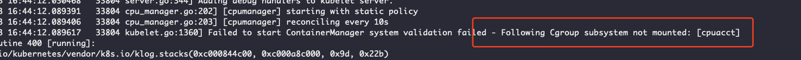

# 问题描述

内核版本： 5.4.56-200.el7.x86_64

docker报错 

```
May 13 16:54:26 8b26d7a8 dockerd[44352]: time="2021-05-13T16:54:26.565235530+08:00" level=warning msg="failed to load plugin io.containerd.snapshotter.v1.devmapper" error="devmapper not configured"
May 13 16:54:26 8b26d7a8 dockerd[44352]: time="2021-05-13T16:54:26.565525512+08:00" level=warning msg="could not use snapshotter devmapper in metadata plugin" error="devmapper not configured"
May 13 16:54:26 8b26d7a8 dockerd[44352]: time="2021-05-13T16:54:26.574734345+08:00" level=warning msg="Your kernel does not support CPU realtime scheduler"
May 13 16:54:26 8b26d7a8 dockerd[44352]: time="2021-05-13T16:54:26.574792864+08:00" level=warning msg="Your kernel does not support cgroup blkio weight"
May 13 16:54:26 8b26d7a8 dockerd[44352]: time="2021-05-13T16:54:26.574800326+08:00" level=warning msg="Your kernel does not support cgroup blkio weight_device"
```

kubelet报错



# 解决

cgroup问题解决：

1、curl https://pi-ops.oss-cn-hangzhou.aliyuncs.com/scripts/cgroupfs-mount.sh | bash

2、重启设备即可解决
